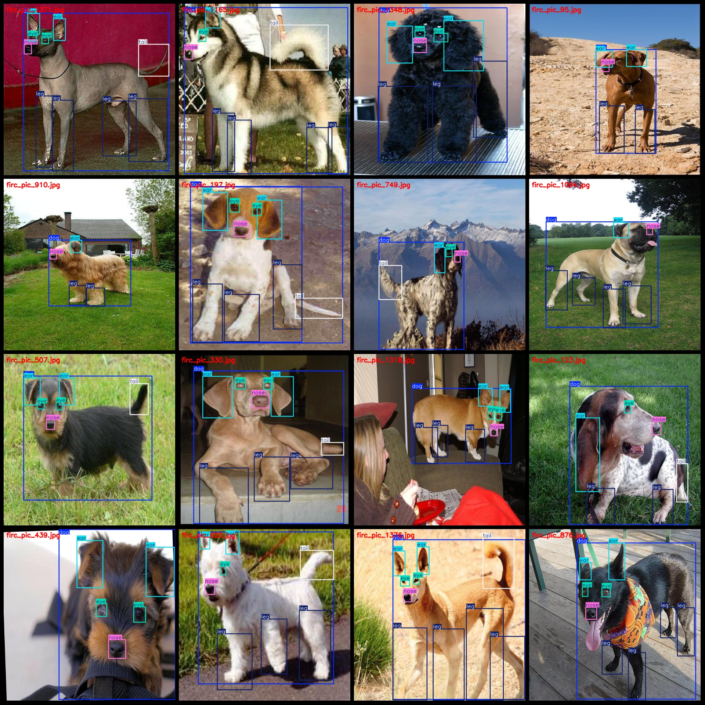
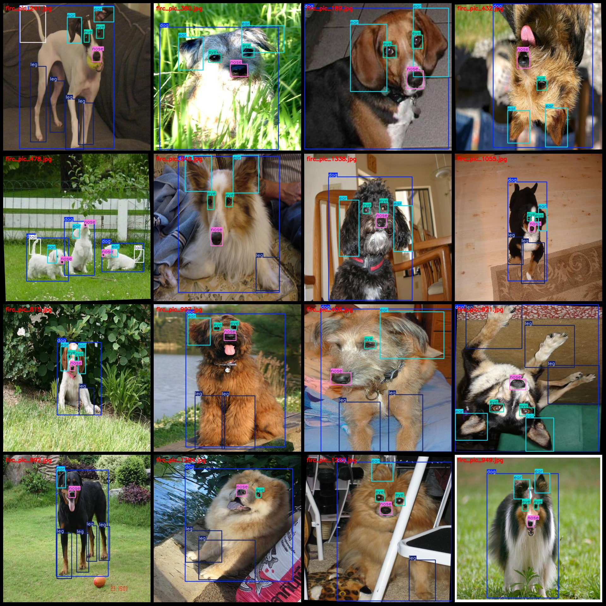

# Dog Part Detection Dataset - VOC+YOLO Format - 1410 Images, 6 Classes

Pascal VOC format and YOLO format (excluding segmentation path) in txt file, only including jpg image and corresponding VOC format xml file and yolo format txt file.
number of images: 1410  
annotation count: 1410  
annotation count: 1410  
annotationnumber of classes: 6  
Annotation class names (Note that the order in the Yolo format is not consistent with this, but is based on the labels file's classes.txt): ["dog", "ear", "eye", "leg", "nose", "tail"]
boxes per class:   
dog box count = 1443  
ear box count = 2091
The number of boxes in an image is often used as a measure of its complexity. In the case of the YOLO model, this count can be useful for understanding the amount of data that needs to be processed by the model. The eye box count is typically calculated by counting the number of bounding boxes in the images, which are used to detect objects in the image.
Leg box count = 2924
Nose box count = 1403
The tail box count is the number of boxes in the last tail. In YOLO, the tail box count is 712.
total boxes: 10494  
images per class:   
The number of dog images is 1410.
The number of ear images is 1310.
The number of eye images is 1202.
The number of leg images is 1116.
The number of nose images is 1372.
The number of tail images is 703.
image resolution: 640x640  
Use annotation tool: labelImg.
Annotation rules: draw a rectangle box around the class.
Important notes: The dataset needs to be divided into training, validation, and test sets, which should be done by yourself.
Special Disclaimer: This dataset does not guarantee the accuracy of the trained model or weight file.
Image Preview:
## Images

Here is a pay link on Stripe ( https://buy.stripe.com/3cs8yP7sY87d0vu9AB ). Please contact me lonlonago@foxmail.com after funding $89, and I will send you a complete data files , thank you!

